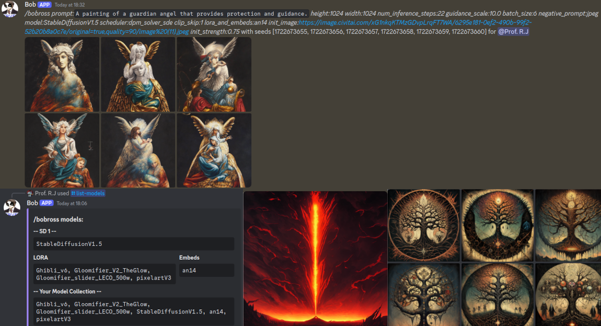

# **bob-bot v1.0**
A simple discord bot based in asyncio that allows you to host text or image generating models on your local machine. It includes a whitelist to limit which channels the bot can respond to.

**Text**:
[Ctransformers](https://github.com/marella/ctransformers) allows the use of novel file types (such as .gguf) in text generation, making it easier for end users to run these models. 
- Idle management to discard some gpu memory after loitering around for long enough without being interacted with.
- Per channel chat memory, with the ability to impersonate a character with a given description, or let the ai make one itself.   

**Image**:
The base [diffusers](https://huggingface.co/docs/diffusers/main/en/using-diffusers/conditional_image_generation) library is used to generate images with stable diffusion models.
- A default config is provided for users to start with, which they can change to their desire and save as presets.
- Has an independent model manager for downloading and storing models, loras, and textual inversions with a civitai link. (Only the base stable diffusion models from their respective dev teams on huggingface can be downloaded.)
- Weighted prompts using [compel](https://github.com/damian0815/compel).

## Installation:
- Create a python venv with an optional prompt: \
`python -m venv .venv --prompt bot` 
- Enter the python venv: \
Linux: `source .venv/bin/activate` \
Windows: `.venv\Scripts\activate.bat` 
- Install required pip dependencies: \
`pip install -r requirements.txt`

## Usage:
Assuming you have python on your system and have set up your discord application on the [developer portal](https://discord.com/developers/applications), you should be good to go but if you want to limit the bots functionality, check the cogs folder and put any unwanted cogs into any other folder or subfolder.

- Setup the bot's config:

Found in the configs folder, config.json stores all external variables for the bot. Fill in the general settings according to your needs as these are the global variables and follow any further instructions there depending on your use case. 

- Enter the python venv: \
Linux: `source .venv/bin/activate` \
Windows: `.venv\Scripts\activate.bat` 

- Run bot.py

`python bot.py`

- Sync commands (Only needed on your first launch):

In a channel the bot can see: \
`;slash guild sync` \
`;slash global sync`

## To-do:
- Reduce the console spam

### Towards v2.0:
The functionality is all there, from a user's perspective one might consider this done. I've tried my best to ensure a stable bot and it seems it can handle being released. However the code is a bit messy, and I do eventually want to include more models for image generation. 
